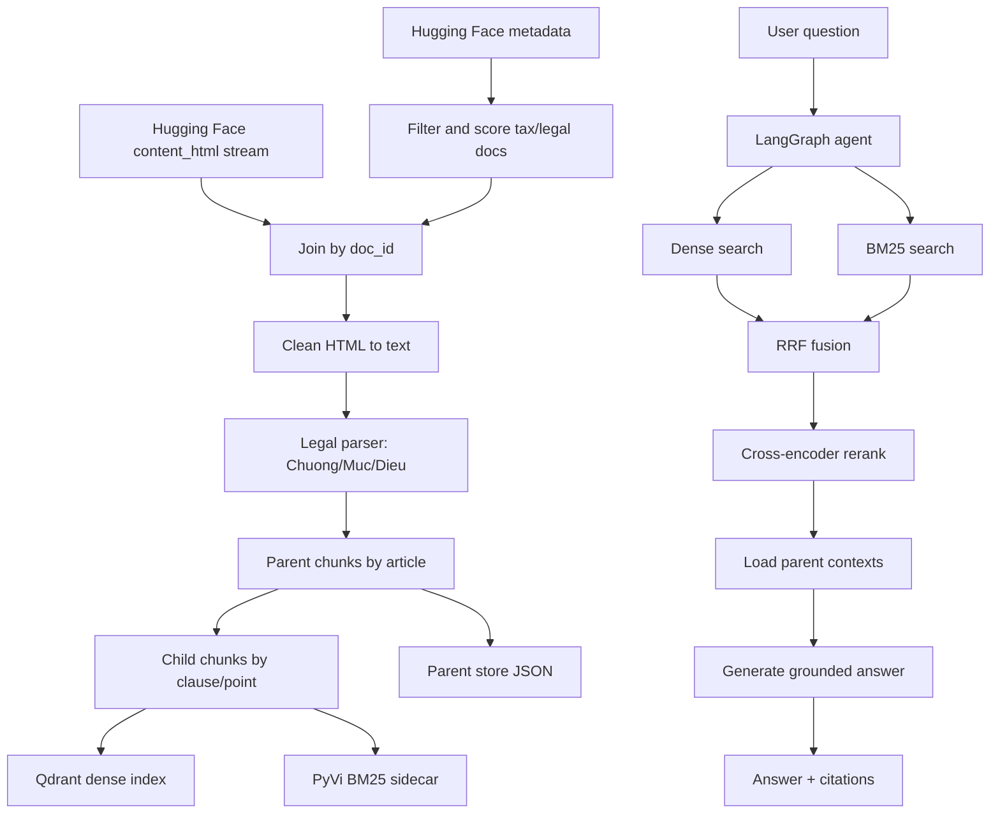
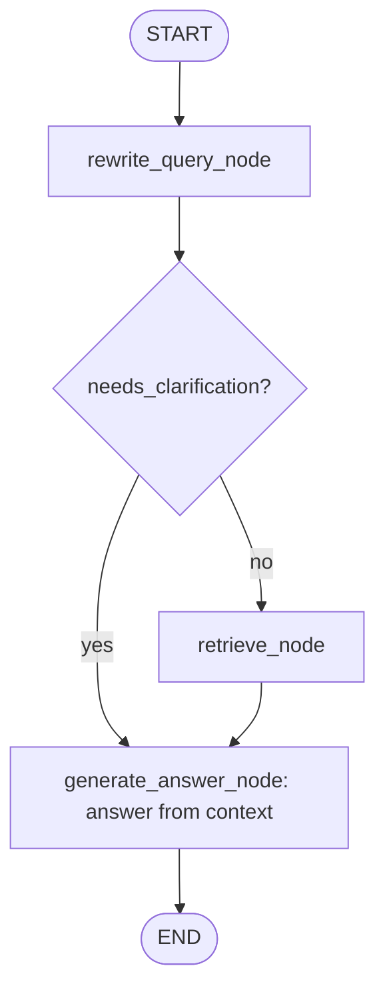
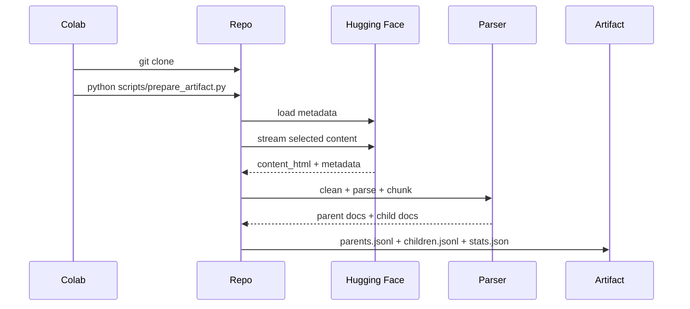
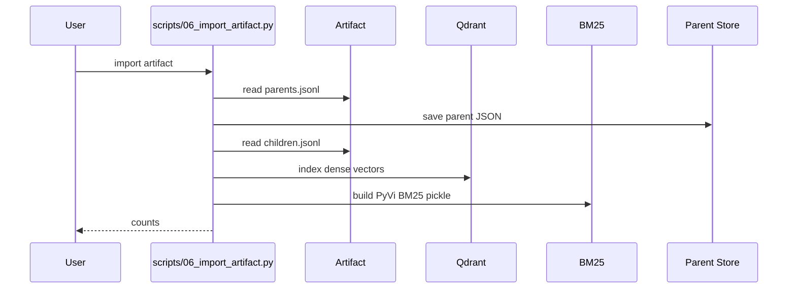

# Huong Dan Chay Tung Phan

Tai lieu nay giup ban chay du an theo tung module de biet loi nam o dau: config, ingestion, parser, chunker, Qdrant, BM25, retrieval hay LLM/agent.

## 0. Cai dat moi truong

```powershell
python -m venv .venv
.\.venv\Scripts\activate
pip install -r requirements.txt
copy .env.example .env
```

Neu chua co Groq key, ban van chay duoc health, artifact import, indexing va retrieval. Rieng `/chat` can `GROQ_API_KEY`.

## 1. Kiem tra API va logging

```powershell
uvicorn app.main:app --reload
```

Mo:

- `http://127.0.0.1:8000/docs`
- `http://127.0.0.1:8000/health`

Neu Qdrant chua chay, health van tra API ok nhung `qdrant.status = unreachable`.

## 2. Chay Qdrant rieng

```powershell
docker compose up qdrant
```

Kiem tra:

- `http://localhost:6333/dashboard`
- `http://localhost:6333/collections`

## 3. Luong khuyen nghi: Colab tao artifact, local import

Khong nen chay preprocessing dataset lon tren may local yeu. Lenh cu sau co the gay lag vi phai stream/scan split `content` lon tren Hugging Face:

```powershell
python -m scripts.02_parse_sample --max-documents 3
```

Cach moi:

```text
GitHub repo chua toan bo code preprocessing
-> Google Colab clone repo va chay scripts/prepare_artifact.py
-> Tai artifact zip ve local
-> Local import artifact vao Qdrant + BM25
-> Chay API/retrieval/chat
```

Nha tuyen dung van thay day du code chunking/indexing trong repo. Colab chi la noi chay code.

## 4. Tao artifact tren Google Colab

Mo notebook:

```text
notebooks/prepare_legal_tax_artifact_colab.ipynb
```

Trong Colab, sua URL repo cua ban roi chay:

```bash
git clone https://github.com/YOUR_USERNAME/AGENTIC-RAG.git
cd AGENTIC-RAG
pip install -r requirements.txt
python scripts/prepare_artifact.py --max-documents 200 --output-dir artifacts/legal_tax_v1_200
zip -r legal_tax_v1_200.zip artifacts/legal_tax_v1_200
```

Tai `legal_tax_v1_200.zip` ve local va giai nen thanh:

```text
artifacts/legal_tax_v1_200/
├── selected_metadata.jsonl
├── parents.jsonl
├── children.jsonl
└── stats.json
```

Uoc luong:

- 100 docs: 2,000-8,000 parent chunks, 4,000-15,000 child chunks.
- 200 docs: 4,000-12,000 parent chunks, 8,000-25,000 child chunks.
- 500 docs: 10,000-30,000 parent chunks, 20,000-60,000 child chunks.

Neu may yeu, bat dau voi `--max-documents 100`.

## 5. Import artifact ve local

Can Qdrant dang chay:

```powershell
docker compose up qdrant
```

Import:

```powershell
python scripts/06_import_artifact.py --artifact-dir artifacts/legal_tax_v1_200 --reset
```

Script nay lam:

- doc `parents.jsonl`;
- luu parent chunks vao `data/parent_store`;
- doc `children.jsonl`;
- index dense vector vao Qdrant;
- build BM25 tieng Viet bang PyVi vao `data/bm25_index.pkl`.

Ket qua mong doi:

```text
parents_imported=...
children_indexed=...
bm25_documents=...
```

## 6. Xem metadata dataset va bo loc domain thue

Lenh nay chi load metadata, nhe hon content:

```powershell
python scripts/01_preview_metadata.py --limit 10
```

Ket qua mong doi:

```text
total_metadata_rows=...
selected_count=...
sample[1] title=...
```

## 7. Xem parser/chunker output

### Cach nhe: doc artifact da tao

```powershell
python scripts/02_parse_sample.py --artifact-dir artifacts/legal_tax_v1_200 --max-documents 3
```

### Cach nang: stream truc tiep Hugging Face

Chi dung khi muon debug pipeline goc tren may khoe:

```powershell
python scripts/02_parse_sample.py --max-documents 3
```

## 8. Index truc tiep tu Hugging Face dataset

Day la cach cu, co the nang. Neu da co artifact thi dung buoc 5 thay vi buoc nay.

```powershell
python scripts/03_index_small.py --max-documents 20 --reset
```

## 9. Test retrieval rieng

Can da import artifact hoac index thanh cong.

```powershell
python scripts/04_search.py "muc thu le phi truoc ba duoc quy dinh nhu the nao?"
```

Retrieval hien tai:

```text
Qdrant dense search
-> PyVi BM25 search
-> RRF fusion
-> cross-encoder rerank
-> load parent contexts
```

BM25 co the dung cho tieng Viet, nhung khong nen whitespace tokenize thuan. Du an dung `pyvi.ViTokenizer` de token hoa tieng Viet, roi hop nhat voi dense ranking bang RRF.

## 10. Test chat agent

Them vao `.env`:

```text
GROQ_API_KEY=...
```

Chay:

```powershell
python scripts/05_chat_once.py "Le phi truoc ba duoc quy dinh nhu the nao?" --debug
```

## 11. Chay qua API

Start API:

```powershell
uvicorn app.main:app --reload
```

Search:

```powershell
curl -X POST "http://127.0.0.1:8000/retrieval/search" -H "Content-Type: application/json" -d "{\"query\":\"muc thu le phi truoc ba\",\"top_k\":5}"
```

Chat:

```powershell
curl -X POST "http://127.0.0.1:8000/chat" -H "Content-Type: application/json" -d "{\"session_id\":\"demo\",\"question\":\"Le phi truoc ba duoc quy dinh nhu the nao?\",\"debug\":true}"
```

## 12. LangSmith Tracing

Them vao `.env`:

```text
LANGSMITH_TRACING=true
LANGSMITH_API_KEY=your_key
LANGSMITH_PROJECT=vietnamese-tax-legal-rag
```

Trace giup xem node LangGraph, prompt, latency, loi LLM va metadata `session_id`. Neu khong co key, app van chay binh thuong.

## 13. RAGAS-lite Custom Evaluation

Sau khi API dang chay va da import artifact:

```powershell
python evals/run_ragas_lite.py --limit 5
```

Output:

```text
eval_reports/ragas_lite_results.jsonl
eval_reports/ragas_lite_summary.md
```

Metric:

- `retrieval_hit`
- `context_precision_lite`
- `citation_present`
- `answer_relevance_lite`
- `refusal_quality`

## Overall RAG Flow



## LangGraph Agent Flow



LangGraph v1 co 3 node:

- `rewrite_query_node`: goi Groq de viet lai cau hoi thanh query ro rang, hoac danh dau can hoi lai.
- `retrieve_node`: goi `LegalRetriever`, gom dense search, BM25, RRF, rerank, load parent context.
- `generate_answer_node`: neu can clarification thi hoi lai; neu co context thi goi Groq sinh cau tra loi co citation.

## Artifact Preparation Flow



## Local Import Flow



## Loi thuong gap

- `No module named ...`: chua chay `pip install -r requirements.txt`.
- `Qdrant unreachable`: chua chay `docker compose up qdrant`.
- `GROQ_API_KEY is required`: chua set key trong `.env`.
- `BM25 index not found`: chua chay `scripts/06_import_artifact.py`.
- Reranker/embedding download cham: lan dau model se duoc tai ve, can internet.
- May lag khi stream dataset: dung Colab artifact workflow thay vi chay Hugging Face content local.
