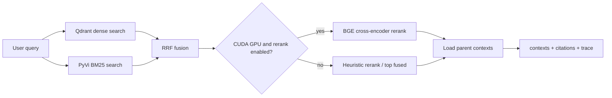
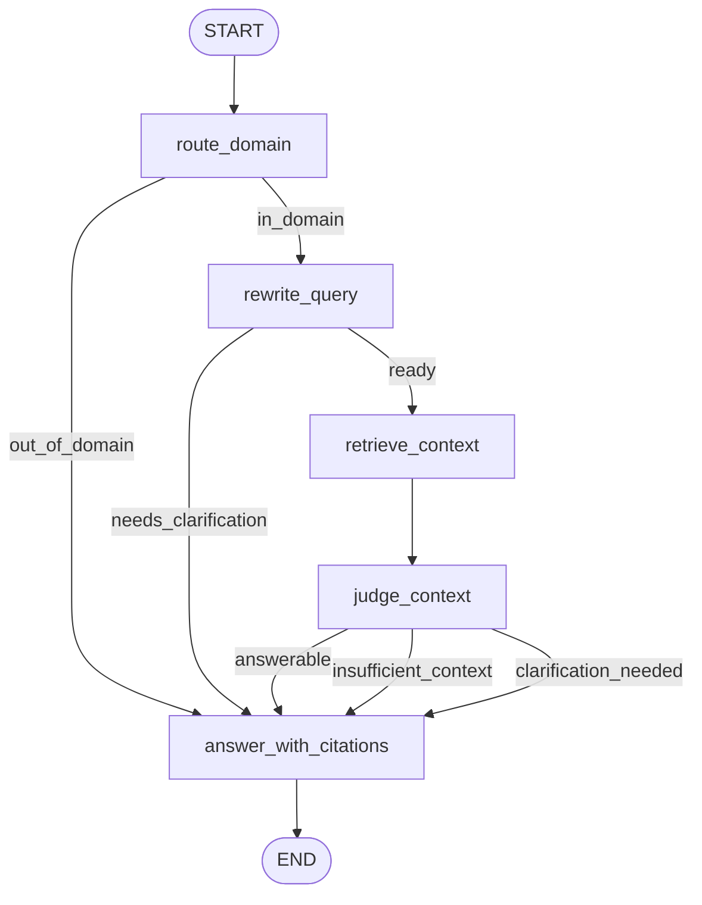
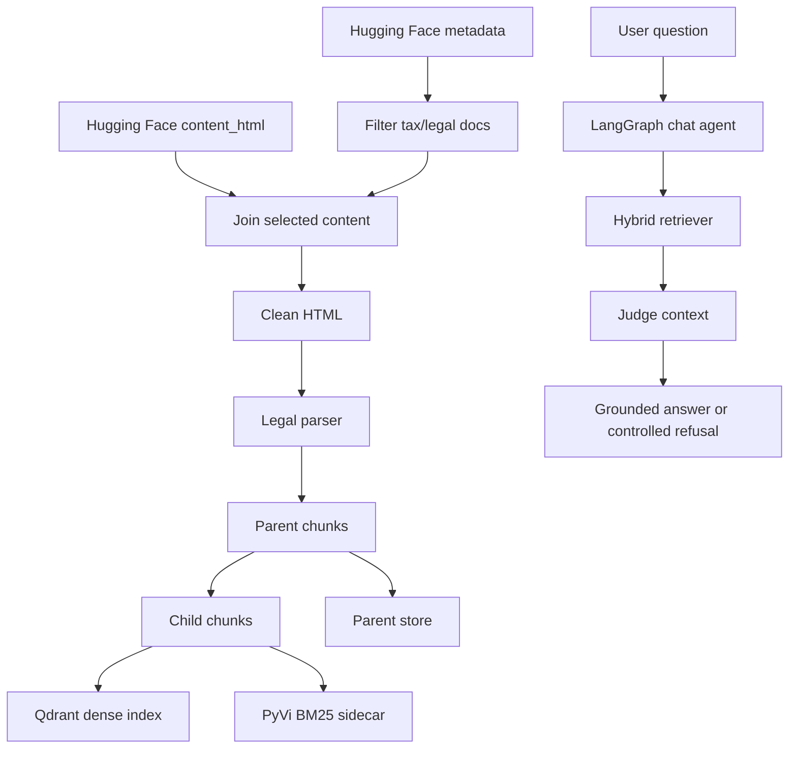

# Huong Dan Chay Tung Phan

Tai lieu nay giup chay va debug tung phan cua Agentic RAG phap luat Viet Nam cho thue, phi, le phi va nghia vu tai chinh lien quan.

## 0. Cai Dat Moi Truong

```powershell
python -m venv .venv
.\.venv\Scripts\activate
pip install -r requirements.txt
```

Them `.env` tai root project:

```text
GROQ_API_KEY=...
GROQ_MODEL=llama-3.3-70b-versatile
GROQ_REWRITE_MODEL=llama-3.1-8b-instant
GROQ_JUDGE_MODEL=llama-3.3-70b-versatile
GROQ_ANSWER_MODEL=llama-3.1-8b-instant
QDRANT_URL=http://localhost:6333
LANGSMITH_TRACING=false
LANGSMITH_ENDPOINT=https://api.smith.langchain.com
LANGSMITH_API_KEY=
LANGSMITH_PROJECT=vietnamese-tax-legal-rag
```

Khong commit `.env`.

## 1. Chay Qdrant

```powershell
docker compose up qdrant
```

Kiem tra:

- `http://localhost:6333/dashboard`
- `http://localhost:6333/collections`

## 2. Tao Artifact Tren Colab

Khong nen preprocess dataset lon tren may local yeu. Chay tren Colab:

```bash
git clone <repo>
cd AGENTIC-RAG
pip install -r requirements.txt
python scripts/prepare_artifact.py --max-documents 100 --output-dir artifacts/legal_tax_v1_100
zip -r legal_tax_v1_100.zip artifacts/legal_tax_v1_100
```

Giai nen ve local thanh:

```text
artifacts/legal_tax_v1_100/
├── selected_metadata.jsonl
├── parents.jsonl
├── children.jsonl
└── stats.json
```

## 3. Import Artifact Ve Local

```powershell
python scripts/06_import_artifact.py --artifact-dir artifacts/legal_tax_v1_100 --reset
```

Script se:

- luu parent chunks vao `data/parent_store`;
- index child chunks vao Qdrant;
- build BM25 PyVi sidecar tai `data/bm25_index.pkl`.

## 4. Chay API Va Gradio UI

```powershell
uvicorn app.main:app --reload
```

Mo:

- `http://127.0.0.1:8000/docs`
- `http://127.0.0.1:8000/health`
- `http://127.0.0.1:8000/ui`

## 5. Test Retrieval Rieng

```powershell
python -m scripts.04_search "mức thu lệ phí trước bạ được quy định thế nào?"
python -m scripts.08_benchmark_retrieval
```

Retrieval flow:



Reranker chi chay khi co GPU CUDA. Neu khong co GPU, he thong dung RRF va heuristic nhe de tranh latency CPU qua cao.

## 6. Test Chat Agent

```powershell
python -m scripts.05_chat_once "tổ chức thu phí, lệ phí có trách nhiệm gì?" --debug
python -m scripts.05_chat_once "quy định về xây dựng nhà ở là gì?" --debug
python -m scripts.05_chat_once "mức phí đó là bao nhiêu?" --debug
```

LangGraph production-lite:



Output `/chat`:

- `answer`
- `citations`
- `out_of_domain`
- `retrieval_trace` khi `debug=true`

## 7. Test Qua API

Health:

```powershell
curl "http://127.0.0.1:8000/health"
```

Chat:

```powershell
curl -X POST "http://127.0.0.1:8000/chat" ^
  -H "Content-Type: application/json" ^
  -d "{\"session_id\":\"demo\",\"question\":\"tổ chức thu phí, lệ phí có trách nhiệm gì?\",\"debug\":true}"
```

Retrieval debug:

```powershell
curl -X POST "http://127.0.0.1:8000/retrieval/search" ^
  -H "Content-Type: application/json" ^
  -d "{\"query\":\"đối tượng chịu lệ phí trước bạ gồm những gì?\",\"top_k\":5,\"debug\":true}"
```

Indexing endpoints:

- `POST /indexing/preview`
- `POST /indexing/run`
- `GET /indexing/status`

Day la endpoint dev/admin. Workflow khuyen nghi la tao artifact roi import bang script.

## 8. Eval Chinh Cho Chat

```powershell
python -m evals.run_eval
```

Eval doc `evals/chat_eval_cases.jsonl` va cham:

- response mode dung;
- `out_of_domain` dung;
- citation metadata hit;
- keyword bat buoc co trong answer;
- forbidden keyword khong xuat hien;
- clarification/refusal khong tra citation gia.

Report:

```text
eval_reports/chat_eval_results.jsonl
```

Neu Groq bi `429 rate_limit_exceeded`, coi do la loi quota/provider va chay lai khi quota on dinh.

## 9. Custom Keyword Smoke Eval

```powershell
python -m evals.run_ragas_lite --limit 5
```

Day khong phai RAGAS day du. No chi la smoke test keyword nhe cho retrieval/answer. Gate chinh cua san pham la `python -m evals.run_eval`.

## 10. LangSmith Tracing

Trong `.env`:

```text
LANGSMITH_TRACING=true
LANGSMITH_ENDPOINT=https://api.smith.langchain.com
LANGSMITH_API_KEY=...
LANGSMITH_PROJECT=vietnamese-tax-legal-rag
```

Chay API hoac CLI. Tren LangSmith, xem trace theo cac node:

- `route_domain`
- `rewrite_query`
- `retrieve_context`
- `judge_context`
- `answer_with_citations`

## 11. Luong Tong The



## 12. Loi Thuong Gap

- `Qdrant unreachable`: chua chay `docker compose up qdrant`.
- `GROQ_API_KEY is required`: chua set key trong `.env`.
- `BM25 index not found`: chua import artifact.
- `LangSmith 401`: sai `LANGSMITH_API_KEY` hoac key khong thuoc workspace/project.
- `Groq 429`: het quota/rate limit, chay lai sau hoac doi model/quota.
- Lan dau tai embedding/reranker model co the cham do download model.
