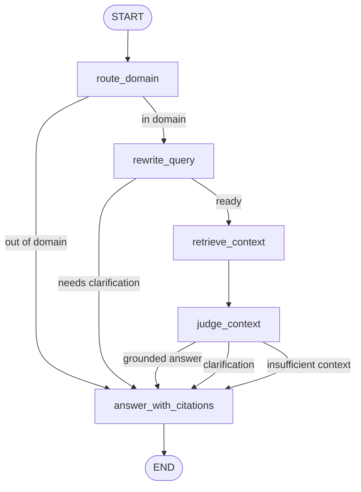
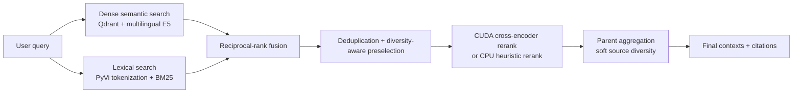
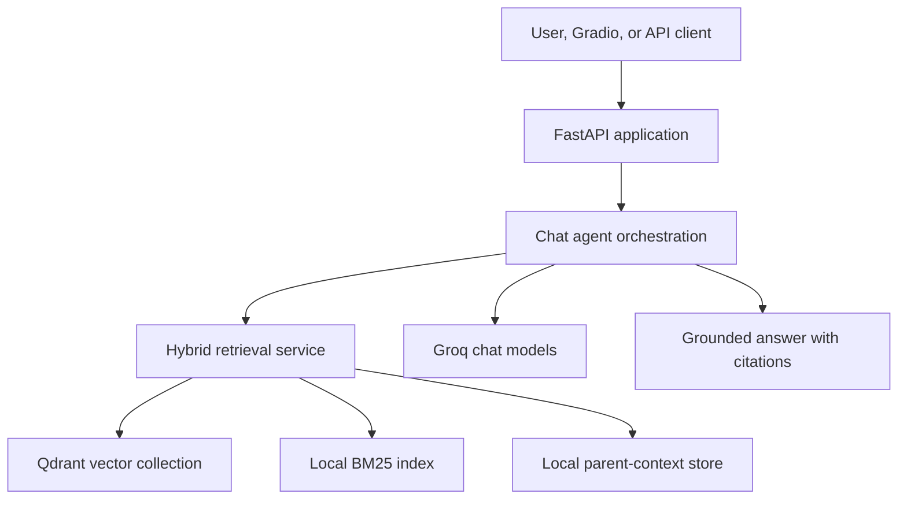
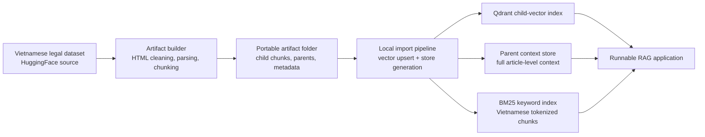

# Vietnamese Tax Legal Agentic RAG

Vietnamese Tax Legal Agentic RAG is a source-grounded legal assistant for Vietnamese tax, fee, charge, and registration-fee questions. The project focuses on the retrieval and citation layer of legal QA: it routes unsupported questions out of scope, rewrites ambiguous in-domain queries, retrieves legal article contexts with hybrid search, judges whether the context is usable, and answers with citations.

The public benchmark is intentionally scoped to **registration-fee article retrieval**. It should be read as a focused retrieval benchmark, not a claim that the system covers the full Vietnamese legal domain.

## What This Project Demonstrates

- Agentic RAG workflow using LangGraph-style nodes: domain routing, query rewrite, retrieval, context judgment, and grounded answer generation.
- Hybrid retrieval over Vietnamese legal text using Qdrant dense vectors, local BM25, reciprocal-rank fusion, diversity-aware candidate selection, optional reranking, and parent-context aggregation.
- Strict source-based evaluation that checks whether retrieved citations match the expected legal document and article.
- Product behavior evaluation for `/chat`, including grounded answers, clarification behavior, out-of-domain handling, expected citations, and forbidden keywords.
- Optional Gradio UI mounted inside the FastAPI app for local demos.
- Reproducible artifact workflow: generated indexes and stores are created locally from the dataset and are not committed to Git.

## Architecture

### Agent Graph



### Retrieval Flow



### System Flow



### Artifact Workflow



## Current Metrics

Main retrieval benchmark: **30 source-labeled registration-fee article retrieval cases** in `evals/retrieval_eval_cases.jsonl`.

| Metric | Value |
| --- | ---: |
| `source_precision@3` | `0.500` |
| `source_recall@3` | `0.833` |
| `hit@1` | `0.767` |
| `hit@3` | `0.833` |
| Retrieval latency p50 | `~1.10s` |

Product behavior gate: `evals.run_eval` checks response mode, out-of-domain routing, clarification behavior, expected citation presence, required answer keywords, and forbidden keywords. The latest local run passed `25/25` cases.

RAG quality can also be evaluated with RAGAS using faithfulness, answer relevancy, context precision, and context recall. RAGAS is slower than product latency because it performs additional LLM judge calls.

## Setup

Create a virtual environment and install dependencies:

```powershell
python -m venv .venv
.\.venv\Scripts\activate
pip install -r requirements.txt
```

Create a local `.env` file. The application reads `.env` first, then ambient environment variables. This template mirrors the runtime variables used by the current local configuration, with secret values replaced by placeholders.

```text
APP_NAME=Vietnamese Tax Legal RAG
APP_ENV=local
LOG_LEVEL=INFO

GROQ_API_KEY=your_groq_key
GROQ_MODEL=llama-3.3-70b-versatile
GROQ_REWRITE_MODEL=llama-3.1-8b-instant
GROQ_JUDGE_MODEL=llama-3.3-70b-versatile
GROQ_ANSWER_MODEL=llama-3.1-8b-instant
LLM_TEMPERATURE=0.0

QDRANT_URL=http://localhost:6333
QDRANT_COLLECTION=legal_tax_child_chunks
USE_QDRANT_SPARSE=false

HF_DATASET_NAME=th1nhng0/vietnamese-legal-documents
MAX_DOCUMENTS_TO_INDEX=3000

EMBEDDING_MODEL=intfloat/multilingual-e5-small
SPARSE_MODEL=Qdrant/bm25
RERANKER_MODEL=BAAI/bge-reranker-v2-m3
ENABLE_RERANKING=true
RETRIEVAL_DENSE_TOP_K=20
RETRIEVAL_BM25_TOP_K=20
RETRIEVAL_FUSION_TOP_K=12
RETRIEVAL_RERANK_TOP_K=5
RETRIEVAL_RRF_K=60
RETRIEVAL_BM25_WEIGHT=2
RETRIEVAL_SKIP_RERANK_BELOW_DOCS=2000

CHILD_CHUNK_SIZE=700
CHILD_CHUNK_OVERLAP=100
FALLBACK_PARENT_CHARS=3500
PARENT_STORE_DIR=data/parent_store
BM25_STORE_PATH=data/bm25_index.pkl

LANGSMITH_TRACING=false
LANGSMITH_API_KEY=
LANGSMITH_PROJECT=vietnamese-tax-legal-rag
LANGSMITH_ENDPOINT=https://api.smith.langchain.com
```

`.env` is ignored by Git. Do not commit secrets.

Optional flags supported by the code but not required in the base `.env` template:

- `ENABLE_GRADIO_UI=true` mounts the Gradio UI at `/ui`.
- `ENABLE_INDEXING_ROUTES=true` exposes indexing API routes.
- `QDRANT_TIMEOUT_S=30` controls Qdrant client timeout.
- `GROQ_RAGAS_JUDGE_MODEL`, `GROQ_RAGAS_MAX_TOKENS`, `RAGAS_RUN_TIMEOUT_S`, `RAGAS_MAX_CASES`, `RAGAS_MAX_WORKERS`, and `RAGAS_OUTPUT_DIR` tune RAGAS evaluation.

## Data Preparation

Generated data is not committed. Build an artifact from the HuggingFace legal dataset, then import it into local stores.

Colab path:

1. Open `notebooks/prepare_legal_tax_artifact_colab.ipynb`.
2. Run the notebook to create a `legal_tax_v1_100` artifact archive.
3. Extract it locally to `artifacts/legal_tax_v1_100/`.

Local path:

```powershell
python -m scripts.prepare_artifact --max-documents 100 --output-dir artifacts/legal_tax_v1_100
```

Import the artifact:

```powershell
docker compose up -d qdrant
python -m scripts.06_import_artifact --artifact-dir artifacts/legal_tax_v1_100 --reset
```

The import step creates the Qdrant child-vector collection, the local parent store under `data/parent_store/`, and the BM25 index at `data/bm25_index.pkl`.

## Run

Start Qdrant:

```powershell
docker compose up -d qdrant
```

Start the API:

```powershell
uvicorn app.main:app --reload
```

Useful endpoints:

| Endpoint | Purpose |
| --- | --- |
| `GET /health` | API and Qdrant readiness check |
| `POST /chat` | Full agentic RAG answer flow |
| `POST /retrieval/search` | Direct retrieval debugging endpoint |
| `GET /docs` | FastAPI OpenAPI docs |
| `GET /ui` | Optional Gradio UI when enabled |

Enable the Gradio UI with:

```text
ENABLE_GRADIO_UI=true
```

Example `/chat` request:

```powershell
curl -X POST "http://127.0.0.1:8000/chat" ^
  -H "Content-Type: application/json" ^
  -d "{\"session_id\":\"demo\",\"question\":\"Nhà đất phải nộp lệ phí trước bạ theo mức phần trăm nào?\",\"debug\":true}"
```

Example `/retrieval/search` request:

```powershell
curl -X POST "http://127.0.0.1:8000/retrieval/search" ^
  -H "Content-Type: application/json" ^
  -d "{\"query\":\"mức thu lệ phí trước bạ ô tô là bao nhiêu?\",\"top_k\":3,\"debug\":true}"
```

## Evaluation

The project uses three complementary evaluation views:

- Product behavior: `evals.run_eval` calls `/chat` and checks response mode, citations, required keywords, forbidden keywords, clarification, and out-of-domain handling.
- Strict retrieval quality: `scripts.09_eval_retrieval_sources` checks source precision, source recall, `hit@1`, and `hit@k` against expected document/article labels.
- Semantic RAG quality: `evals.run_ragas` checks faithfulness, answer relevancy, context precision, and context recall with an LLM judge.

Run the product behavior gate:

```powershell
python -m evals.run_eval
```

Run strict retrieval metrics:

```powershell
python -m scripts.09_eval_retrieval_sources
```

Run retrieval diagnostics:

```powershell
python -m scripts.08_benchmark_retrieval
```

Run RAGAS in small batches because judge calls are slow and rate-limit sensitive:

```powershell
python -m evals.run_ragas --limit 5
python -m evals.run_ragas --start 5 --limit 5
```

## Development Checks

```powershell
python -m pytest
python -m compileall app evals scripts
```

Smoke test with Qdrant and the API running:

```powershell
docker compose up -d qdrant
uvicorn app.main:app --reload
```

Then call `/health`, `/chat`, and `/retrieval/search`.

## Limitations

- The public benchmark is scoped to registration-fee article retrieval, not the whole Vietnamese legal domain.
- Retrieval still favors recall; noisy extra citations remain in some categories.
- RAGAS latency is evaluation latency, not product `/chat` latency.
- Cross-encoder reranking is only used when CUDA is available; CPU-only runs use heuristic reranking for lower latency.
