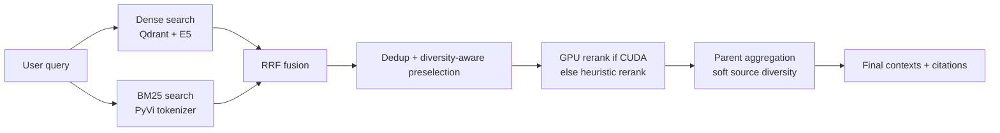
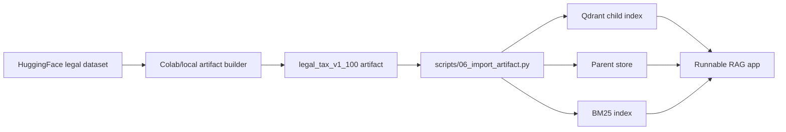
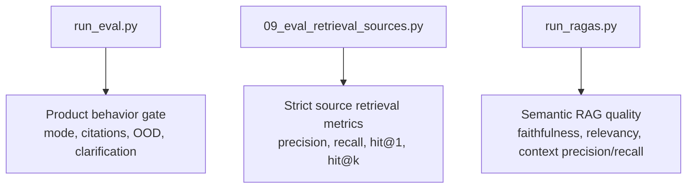

# Vietnamese Tax Legal Agentic RAG

Vietnamese Tax Legal Agentic RAG is a FastAPI-based legal assistant for Vietnamese tax, fee, charge, and registration-fee questions. It combines hybrid retrieval, source-grounded answering, deterministic routing, and evaluation tooling designed to make retrieval quality measurable rather than visually impressive but unverifiable.

The current public benchmark is scoped to **registration-fee article retrieval**. It is not presented as a full legal-domain benchmark.

## Highlights

- LangGraph agent with domain routing, query rewrite, retrieval, context judgment, and citation-grounded answering.
- Hybrid retrieval with Qdrant dense search, PyVi BM25, reciprocal rank fusion, diversity-aware preselection, and parent-context aggregation.
- GPU-only cross-encoder reranking; CPU-only environments fall back to fast heuristic reranking.
- Two evaluation layers: product behavior tests for `/chat` and strict article-level retrieval metrics.
- Optional Gradio UI mounted inside the FastAPI app.
- Colab/local artifact workflow for preparing legal chunks without committing generated data.

## Architecture

### LangGraph Agent


### Retrieval Flow



### System Flow

```mermaid
flowchart TD
    user["User / Gradio / API client"] --> api["FastAPI"]
    api --> graph["LangGraph chat agent"]
    graph --> retriever["Hybrid retriever"]
    retriever --> qdrant["Qdrant vector DB"]
    retriever --> bm25["Local BM25 index"]
    retriever --> parents["Parent store"]
    graph --> llm["Groq LLM"]
    graph --> response["Grounded answer + citations"]
```

### Artifact Workflow



### Evaluation Flow



## Current Metrics

Main retrieval benchmark: **30 source-labeled registration-fee article retrieval cases** in `evals/retrieval_eval_cases.jsonl`.

| Metric | Value |
| --- | ---: |
| `source_precision@3` | `0.500` |
| `source_recall@3` | `0.833` |
| `hit@1` | `0.767` |
| `hit@3` | `0.833` |
| Retrieval latency p50 | `~1.10s` |

Product behavior gate: `evals.run_eval` checks grounded answers, clarification behavior, out-of-domain routing, expected citations, and forbidden keywords. The latest local run passed `25/25` cases.

These numbers are intentionally reported with scope. The system is strongest on registration-fee article lookup and still has known retrieval noise on broader legal governance questions.

## Setup

Create a virtual environment and install dependencies:

```powershell
python -m venv .venv
.\.venv\Scripts\activate
pip install -r requirements.txt
```

Create a local `.env` file:

```text
GROQ_API_KEY=your_groq_key
GROQ_MODEL=llama-3.3-70b-versatile
GROQ_REWRITE_MODEL=llama-3.1-8b-instant
GROQ_JUDGE_MODEL=
GROQ_ANSWER_MODEL=llama-3.1-8b-instant
GROQ_RAGAS_JUDGE_MODEL=openai/gpt-oss-20b
GROQ_RAGAS_MAX_TOKENS=4096

QDRANT_URL=http://localhost:6333
QDRANT_COLLECTION=legal_tax_child_chunks
QDRANT_TIMEOUT_S=30
USE_QDRANT_SPARSE=false

ENABLE_GRADIO_UI=false
ENABLE_INDEXING_ROUTES=false
LANGSMITH_TRACING=false
LANGSMITH_API_KEY=
LANGSMITH_PROJECT=vietnamese-tax-legal-rag
```

`.env` is ignored by Git. Do not commit secrets.

## Data Preparation

Generated artifacts are not committed. Build them from the HuggingFace dataset using either Colab or a local machine.

Colab path:

1. Open `notebooks/prepare_legal_tax_artifact_colab.ipynb`.
2. Run the notebook to create `legal_tax_v1_100.zip`.
3. Download and extract it into `artifacts/legal_tax_v1_100/` locally.

Local path:

```powershell
python -m scripts.prepare_artifact --max-documents 100 --output-dir artifacts/legal_tax_v1_100
```

Import the artifact into local stores:

```powershell
docker compose up -d qdrant
python -m scripts.06_import_artifact --artifact-dir artifacts/legal_tax_v1_100 --reset
```

This creates:

- Qdrant child-vector collection
- local parent store under `data/parent_store/`
- local BM25 index at `data/bm25_index.pkl`

## Run

Start the API:

```powershell
uvicorn app.main:app --reload
```

Useful endpoints:

- API docs: `http://127.0.0.1:8000/docs`
- Health: `http://127.0.0.1:8000/health`
- Chat: `POST http://127.0.0.1:8000/chat`
- Retrieval debug: `POST http://127.0.0.1:8000/retrieval/search`

Enable the Gradio UI by setting:

```text
ENABLE_GRADIO_UI=true
```

Then open:

```text
http://127.0.0.1:8000/ui
```

Example chat request:

```powershell
curl -X POST "http://127.0.0.1:8000/chat" ^
  -H "Content-Type: application/json" ^
  -d "{\"session_id\":\"demo\",\"question\":\"Nhà đất phải nộp lệ phí trước bạ theo mức phần trăm nào?\",\"debug\":true}"
```

## Evaluation

Run the product behavior gate:

```powershell
python -m evals.run_eval
```

Run strict retrieval metrics:

```powershell
python -m scripts.09_eval_retrieval_sources
```

Run retrieval diagnostics:

```powershell
python -m scripts.08_benchmark_retrieval
```

Run RAGAS semantic evaluation in small batches because judge calls are slow and rate-limit sensitive:

```powershell
python -m evals.run_ragas --limit 5
python -m evals.run_ragas --start 5 --limit 5
```

RAGAS reports are written to `eval_reports/`, which is ignored by Git.

## Development Checks

```powershell
python -m pytest
python -m compileall app evals scripts
```

Smoke test with Qdrant running:

```powershell
docker compose up -d qdrant
uvicorn app.main:app --reload
```

Then call `/health`, `/chat`, and `/retrieval/search`.

## Limitations

- The public benchmark is scoped to registration-fee article retrieval, not the whole Vietnamese legal domain.
- Retrieval is still recall-oriented; noisy citations remain on some categories.
- RAGAS evaluation is slower than product latency because it performs additional LLM judge calls.
- Cross-encoder reranking is only used when CUDA is available; CPU-only runs use heuristic reranking for latency.

## Repository Hygiene

The following are intentionally ignored:

- `.env`
- `.venv/`
- `data/`
- `artifacts/legal_tax_v1_*/`
- `eval_reports/`
- local logs
- personal runbook notes
