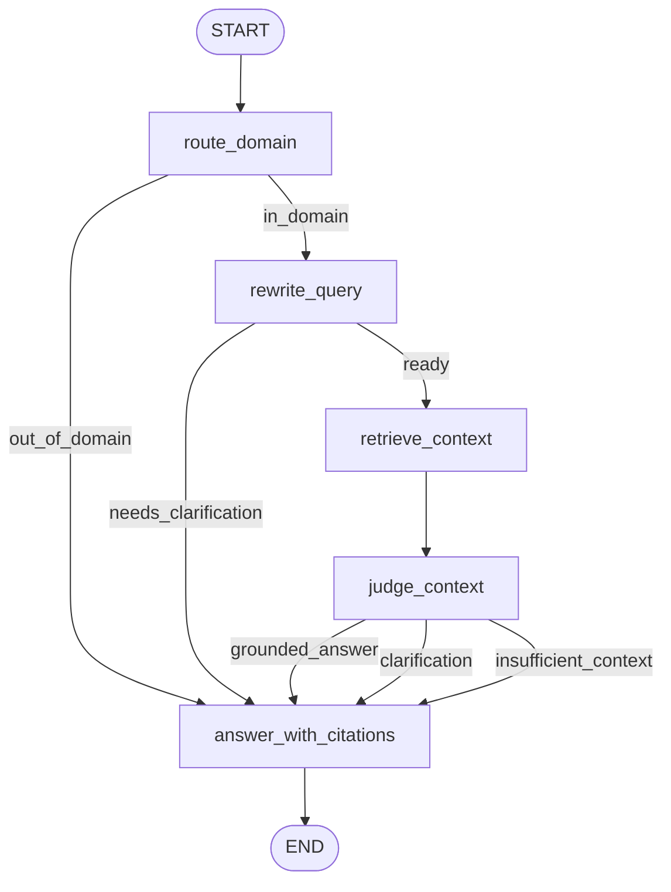

# Vietnamese Tax Legal Agentic RAG

FastAPI backend for a Vietnamese legal RAG assistant focused on tax, fees, charges, lệ phí trước bạ, and related financial obligations. The system uses a Colab/local artifact workflow, Qdrant dense retrieval, PyVi BM25, RRF fusion, optional GPU-only reranking, LangGraph orchestration, Groq LLMs, LangSmith tracing, and an optional Gradio UI mounted at `/ui`.

For detailed step-by-step commands, see [HUONG_DAN_CHAY_TUNG_PHAN.md](HUONG_DAN_CHAY_TUNG_PHAN.md).

## Setup

```powershell
python -m venv .venv
.\.venv\Scripts\activate
pip install -r requirements.txt
```

Create or update local `.env`:

```text
GROQ_API_KEY=...
GROQ_MODEL=llama-3.3-70b-versatile
GROQ_REWRITE_MODEL=llama-3.1-8b-instant
GROQ_JUDGE_MODEL=llama-3.3-70b-versatile
GROQ_ANSWER_MODEL=llama-3.1-8b-instant
QDRANT_URL=http://localhost:6333
LANGSMITH_TRACING=false
LANGSMITH_ENDPOINT=https://api.smith.langchain.com
LANGSMITH_API_KEY=
LANGSMITH_PROJECT=vietnamese-tax-legal-rag
```

`.env` is local-only and ignored by git. Do not commit secrets.

## Data Workflow

Prepare artifact on Colab or a stronger machine:

```bash
git clone <repo>
cd AGENTIC-RAG
pip install -r requirements.txt
python scripts/prepare_artifact.py --max-documents 100 --output-dir artifacts/legal_tax_v1_100
zip -r legal_tax_v1_100.zip artifacts/legal_tax_v1_100
```

Import artifact locally:

```powershell
docker compose up qdrant
python scripts/06_import_artifact.py --artifact-dir artifacts/legal_tax_v1_100 --reset
```

This imports parent chunks into local storage, indexes child chunks into Qdrant, and builds `data/bm25_index.pkl`.

## Run API And UI

```powershell
uvicorn app.main:app --reload
```

Open:

- API docs: `http://127.0.0.1:8000/docs`
- Health: `http://127.0.0.1:8000/health`
- Gradio UI: `http://127.0.0.1:8000/ui`

Chat API:

```powershell
curl -X POST "http://127.0.0.1:8000/chat" ^
  -H "Content-Type: application/json" ^
  -d "{\"session_id\":\"demo\",\"question\":\"tổ chức thu phí, lệ phí có trách nhiệm gì?\",\"debug\":true}"
```

Retrieval debug API:

```powershell
curl -X POST "http://127.0.0.1:8000/retrieval/search" ^
  -H "Content-Type: application/json" ^
  -d "{\"query\":\"mức thu lệ phí trước bạ được quy định thế nào?\",\"top_k\":5,\"debug\":true}"
```

`/indexing/*` endpoints are development/admin helpers for previewing and running indexing. The recommended production-lite workflow is artifact import plus `/chat`.

## LangGraph Chat Agent

Production-lite graph:



Node responsibilities:

- `route_domain`: deterministic tax/fee domain gate.
- `rewrite_query`: light normalization only; asks clarification for vague references.
- `retrieve_context`: calls the existing hybrid retriever and preserves trace.
- `judge_context`: decides whether context is enough to answer, ask back, or refuse.
- `answer_with_citations`: single exit node for grounded answer, clarification, out-of-domain, or insufficient context.

## Evaluation

Main chat-level gate:

```powershell
python -m evals.run_eval
```

The eval checks response mode, out-of-domain behavior, expected citation metadata, expected answer keywords, and forbidden keywords. Results are written to `eval_reports/chat_eval_results.jsonl`.

Retrieval diagnostic:

```powershell
python -m scripts.08_benchmark_retrieval
```

Custom keyword smoke eval:

```powershell
python -m evals.run_ragas_lite --limit 5
```

This is not full RAGAS. It is a shallow keyword smoke test for quick retrieval/answer regressions. Use `evals.run_eval` as the product acceptance gate for `/chat`.

## LangSmith Tracing

Set in `.env`:

```text
LANGSMITH_TRACING=true
LANGSMITH_ENDPOINT=https://api.smith.langchain.com
LANGSMITH_API_KEY=...
LANGSMITH_PROJECT=vietnamese-tax-legal-rag
```

Run API or CLI tests. In LangSmith, inspect one `/chat` trace by nodes: `route_domain`, `rewrite_query`, `retrieve_context`, `judge_context`, `answer_with_citations`.

## Useful Local Tests

```powershell
.\.venv\Scripts\python.exe -m pytest
.\.venv\Scripts\python.exe -m compileall app evals scripts
.\.venv\Scripts\python.exe -m scripts.05_chat_once "tổ chức thu phí, lệ phí có trách nhiệm gì?" --debug
.\.venv\Scripts\python.exe -m scripts.05_chat_once "quy định về xây dựng nhà ở là gì?" --debug
```

## Notes

- Reranking is enabled only when a CUDA GPU is available; otherwise retrieval uses RRF plus lightweight heuristic reranking.
- Groq quota/rate-limit errors can trigger deterministic or extractive fallbacks. Treat those runs as provider-limit events, not final quality signals.
- Scale data gradually: 100 -> 200 -> 500 documents, and rerun chat eval after each scale step.
